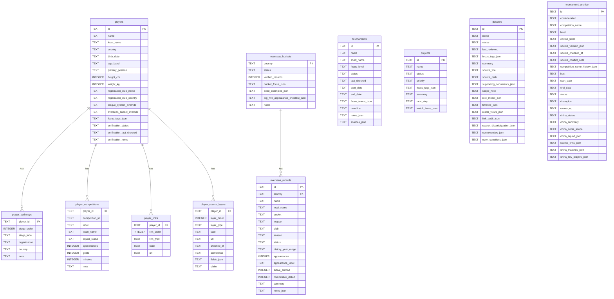

# SQLite 本地库

更新时间：2026-06-28

`scripts/sync-sqlite.mjs` 会把当前 JSON 数据同步到 `storage/youth-football.sqlite`。这个数据库用于本地查询、调试和后续分析，不提交仓库，也不发布到 GitHub Pages。

## 生成方式

```bash
npm run sync-sqlite
```

或：

```bash
npm run prepare-data
```

脚本每次运行都会删除旧的 `storage/youth-football.sqlite` 并重建。`storage/*.sqlite`、`storage/*.sqlite-shm`、`storage/*.sqlite-wal` 已在 `.gitignore` 中排除。

## ER 图



## 表说明

| 表 | 来源 | 说明 |
| --- | --- | --- |
| `players` | `data/raw/players/*.json` 经 loader 补全 | 球员主表；多语言姓名、注册俱乐部、校验状态和标签压到一行。 |
| `player_pathways` | `players[].training_pathway` | 球员青训、学校、项目和俱乐部路径，按 `stage_order` 排序。 |
| `player_competitions` | `players[].tournament_participation` | 球员赛事报名、出场、进球、分钟和名单状态。 |
| `player_links` | `players[].external_links` | 球员外部来源链接。 |
| `player_source_layers` | `players[].source_layers` | 可选来源层级说明；把来源类型、支撑字段、confidence 和 claim 结构化。 |
| `tournaments` | `data/raw/tournaments.json` | 当前重点赛事卡。 |
| `projects` | `data/raw/projects.json` | 专题项目卡。 |
| `overseas_buckets` | `data/raw/overseas-history.json` 的国家层 | 留洋国家线、bucket 说明、代表样本数量和备注。 |
| `overseas_records` | `countries[].featured_records` | 留洋精选记录；不是官方全量人数表。 |
| `dossiers` | `data/raw/dossiers.json` | 深度专题档案。 |
| `tournament_archive` | `data/raw/tournament-archive.json` | 历史赛事归档和中国队相关结果。 |

## JSON 字段

SQLite 表只把高频查询字段拆成列，其余复杂结构以 `*_json` 文本保存，例如：

- `focus_tags_json`
- `notes_json`
- `sources_json`
- `watch_items_json`
- `china_matches_json`
- `supporting_documents_json`

查询时需要在应用层或 SQLite JSON 函数中解析这些字段。当前脚本不依赖 JSON1 扩展特性，主要保证 Node 内置 SQLite 能生成数据库。

## 不进入 SQLite 的内容

当前 SQLite 不包含：

- `data/site/**` 的前端聚合结果。
- Transfermarkt market value 的独立历史点明细；球员身价只在 loader 合并后进入玩家对象，但 `sync-sqlite.mjs` 目前没有单独建 market value 表。
- `club_name_overrides` 的独立表。
- 页面 UI 文案、CSS、图片或输出产物。

后续可做：

- 增加 `player_market_values` 表，拆出 current、peak、checked_at、source URL。
- 增加 `source_links` 通用表，统一 tournaments、dossiers、coaches 和 archive 的来源链接。
- 给 `competition_id` 增加外键到 `tournaments(id)` 或独立赛事维表；当前 `player_competitions.competition_id` 允许为空，也可能引用 archive 之外的文本口径。
- 增加 schema version 表，记录 SQLite 结构变更。
