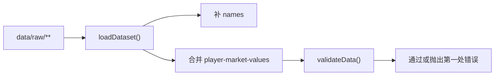

# 数据校验脚本

更新时间：2026-06-27

`scripts/validate-data.mjs` 是当前数据变更的第一道程序化检查。运行方式：

```bash
npm run validate-data
```

成功时会输出类似：

```text
Validated 171 players, 12 tournaments, 9 projects.
```

## 校验链路



校验会通过 `scripts/lib/data-loader.mjs` 读取所有 raw JSON，所以它检查的是 loader 合并后的数据，而不是单个文件的孤立结构。

## 已校验内容

球员：

- 必填字段：`id`、`name`、`local_name`、`names`、`country`、`birth_date`、`age_band`、`primary_position`、`registration_club`、`training_pathway`、`focus_tags`、`tournament_participation`、`external_links`、`verification`。
- `birth_date` 和核验日期格式必须是 `YYYY-MM-DD`。
- 多语言姓名块必须包含 `zh`、`en`、`native`，日本球员需 `ja`，韩国球员需 `ko`。
- `registration_club.name` 和 `registration_club.country` 必须是字符串。
- `training_pathway` 不能为空，每一步至少有 `stage_label`、`organization`、`country`。
- `external_links` 不能为空，且每条必须有合法 `type`、`label`、`http/https url`。
- `tournament_participation[].competition_id` 如存在，必须能对应 `data/raw/tournaments.json`。
- `squad_status` 必须来自允许枚举。
- `verification.status` 必须来自允许枚举，`notes` 必填。
- `verification.evidence` 如存在，需包含字段、claim、来源标签、来源 URL 和核验日期。
- `player.id` 不得重复。
- `birth_date + 标准化姓名` 不得与另一球员重复，用于发现同一球员跨文件重复建档。
- `league_system_override` 必须是非空字符串。
- `overseas_bucket_override` 必须来自 `overseas-history.json` 的 `bucket_definition`。
- `market_value` 如存在，需具备 status、checked_at、source、current/peak 点位结构。

赛事和专题：

- `tournaments[].last_checked`、`date_range.start`、`date_range.end` 必须是日期。
- `overseas-history` 的 bucket、featured records、big five checklist 结构必须可用。
- `dossiers` 必须有 `id`、`name`、`last_reviewed`、`timeline`、`roster_views`，可选 link audit 和 search disambiguation 也会校验日期与数组结构。
- `tournament-archive` 必须有赛事 ID、名称、日期、来源链接、中国队比赛和关键球员数组。
- `china-men-youth-coaches` 校验队伍周期、教练、集训节点、staff 和来源链接。
- `big-five-asian-coaches` 校验来源链接、scope count、教练战绩和 club records 加总。

## 允许枚举

`verification.status`：

- `verified`
- `mixed-source`
- `provisional`
- `needs-review`
- `conflict`
- `stale`
- `rejected`

`external_links.type`：

- `official`
- `club`
- `stats`
- `news`
- `wikipedia`
- `transfermarkt`
- `school`
- `profile`
- `match`
- `reference`

`squad_status`：

- `registered`
- `tracked`
- `pending-transfer`
- `called-up`
- `selected`
- `withdrawn`
- `unknown`
- `used`

## 不校验内容

`validate-data` 不会判断：

- 外部链接是否仍能访问。
- 来源内容是否真的支持对应事实。
- Transfermarkt API 是否最新。
- 出场、进球、分钟是否和官方报告一致。
- `data/site/**` 是否和当前 raw 数据完全同步。
- `generated_at` 是否应该更新。
- 文本摘要是否中立、完整或无歧义。
- 未成年人隐私和版权风险是否已经人工审查。
- 所有历史名单是否达到全量覆盖。

这些仍需要 PR review、人工核验或后续自动化脚本。

## 常见失败处理

| 报错片段 | 含义 | 处理 |
| --- | --- | --- |
| `Missing player field` | 球员缺必填字段 | 对照同文件相邻记录补字段 |
| `Duplicate player id` | ID 重复 | 合并记录或重命名新 ID |
| `Possible duplicate player identity` | 同生日同姓名疑似重复 | 判断是否同一人；如是则合并 |
| `Unknown competition_id` | 球员引用了不存在的赛事 ID | 先补 `data/raw/tournaments.json` 或移除引用 |
| `Invalid external link type` | 链接类型不在枚举内 | 改用已有类型，必要时先扩展校验脚本和治理文档 |
| `Invalid squad_status` | 名单状态不在枚举内 | 使用治理文档定义的状态 |
| `Coach record does not add up` | 教练胜平负与场次不一致 | 修正 club record 或汇总 record |

## 后续可做

- 增加 `npm run validate-generated`，比较 `data/site/**` 是否由当前 raw 生成。
- 增加 HTTP link checker，但默认只输出报告，不直接失败，以免临时网络波动阻塞数据 PR。
- 把 `source_links` 也统一到 typed source schema。
- 增加 JSON Schema，方便编辑器实时提示。
- 对 `generated_at`、`last_checked` 和 stale 规则增加自动报告。
